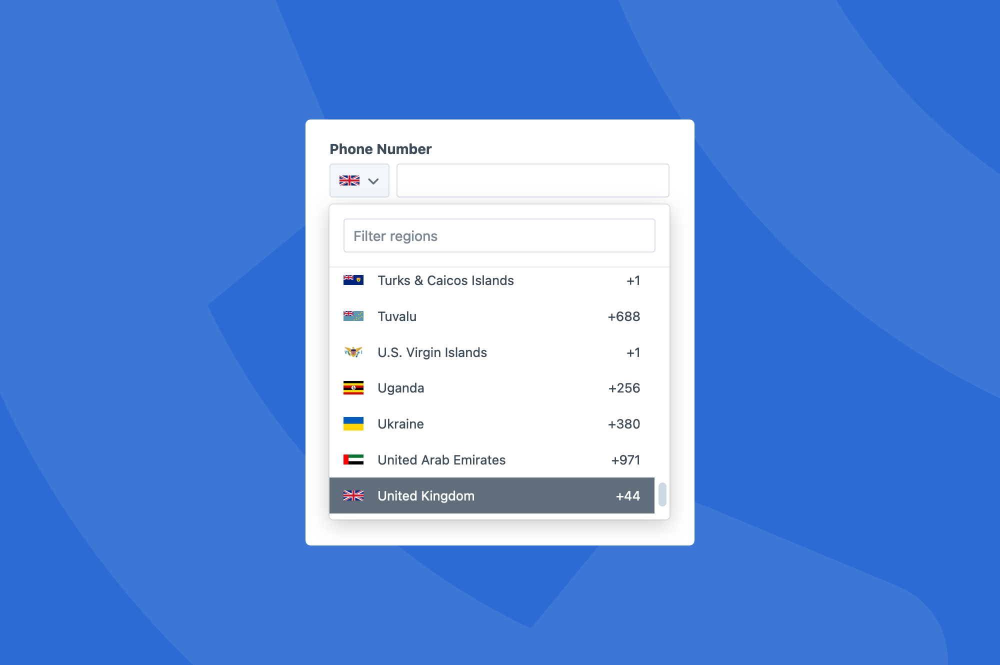

# Phone Number

This plugin adds a new fieldtype to Craft for entering and validating international phone numbers, and getting information about those numbers.

A Twig extension for extracting numbers from text.

It's built on the excellent [libphonenumber-for-php](https://github.com/giggsey/libphonenumber-for-php) port of Google's [libphonenumber](https://github.com/google/libphonenumber) library. 



## Features

- Field type for entering and validating international phone numbers.
- GraphQL support for both query and mutating phone number fields.
- Support for field and element condition rules.
- Twig filter for extracting number from text.

## Requirements

This plugin requires Craft CMS 5.0.0 or later.

## Installation

You can install this plugin from the Plugin Store or with Composer.

### From the Plugin Store

Go to the Plugin Store in your project’s Control Panel and search for "Phone Number". Then click on the "Install" button in its modal window.

### With Composer

Open your terminal and run the following commands:

```bash
# Go to the project directory
cd /path/to/project

# Tell Composer to load the plugin
composer require rynpsc/craft-phone-number

# Tell Craft to install the plugin
./craft install/plugin phone-number
```

## Field Type

The Phone Number field provides an easy way of parsing, formatting, storing and validating international phone numbers.


### Working with Phone Number Field Data

The Phone Number field returns a PhoneNumberModel.

#### region

The raw region code as entered within the field.

```twig
{{ entry.fieldHandle.region }}
```

#### number

The raw number as entered within the field.

```twig
{{ entry.fieldHandle.number }}
```

#### getCountryCode()

The numerical country code.

```twig
{{ entry.fieldHandle.getCountryCode() }}
```

#### getRegionCode()

The alphabetical region code.

```twig
{{ entry.fieldHandle.getRegionCode() }}
```

#### getLink()

Returns a phone number link, see [links](#links).

```twig
{{ entry.fieldHandle.getLink() }}
```

#### getType()

Returns the number type.

```twig
{{ entry.fieldHandle.getType() }}
```

Number types are returned as integers.

| Value | Type                 |
|:------|:---------------------|
| 0     | Fixed line           |
| 1     | Mobile               |
| 2     | Fixed line or mobile |
| 3     | Toll free            |
| 4     | Premium rate         |
| 5     | Shared cost          |
| 6     | VOIP                 |
| 7     | Personal number      |
| 8     | Pager                |
| 9     | UAN                  |
| 10    | Unknown              |
| 27    | Emergency            |
| 28    | Voicemail            |
| 29    | Short code           |
| 30    | Standard rate        |
 
#### getDescription(locale, region)

Returns a description for the number in the supplied locale.

The description returned might consist of the name of the country, or the name of the geographical area the phone number is from.

If `region` is supplied, it will also be taken into consideration. If the phone number is from the same region, only a lower-level description will be returned.

```twig
{# Manchester #}
{{ entry.fieldHandle.getDescription('en-GB') }}

{# Manchester #}
{{ entry.fieldHandle.getDescription('en-GB', 'GB') }}

{# United Kingdom #}
{{ entry.fieldHandle.getDescription('en-GB', 'US') }}
```

##### format(format)

Formats a phone number.

```twig
{{ entry.fieldHandle.format('international') }}
```

Numbers can be formatted in the following formats:

| Format        | Example Output       |
|:--------------|:---------------------|
| e164          | +441174960123        |
| rfc3966       | tel:+44-117-496-0123 |
| national      | 0117 496 0123        |
| international | +44 117 496 0123     |

The rfc3966 format is also available via the `tel` alias.

##### formatForCountry(region)

Formats the phone number based on the `region`.

```twig
{{ entry.fieldHandle.formatForCountry() }}
```

##### formatForMobileDialing(region, withFormatting)

Formats the phone number in a way that it can be dialled from the provided `region`. The `withFormatting` parameter determines whether there is any formatting applied to the number.

```twig
{{ entry.fieldHandle.formatForMobileDialing() }}
```

### Querying Elements with Phone Number Fields

When querying for elements that have a Phone Number field, you can filter the results based on the Phone Number field data using a query param named after your field’s handle.

Possible values include:

| Value                                | Description                                  |
|:-------------------------------------|----------------------------------------------|
| `':empty:'`                          | Field doesn't have a number                  |
| `':notempty:'`                       | Field does have a number                     |
| `{ region: ['GB'] }`                 | Number has the region "GB"                   |
| `{ region: ['not', 'GB'] }`          | Number doesn't have the region "GB"          |
| `{ number: ['01234567890'] }`        | Number is equal to "01234567890"             |
| `{ number: ['not', '01234567890'] }` | Number is not equal to "01234567890"         |
| `{ number: '*0' }`                   | Number ends with "0"                         |
| `{ number: ['not', '*0'] }`          | Number doesn't end with "0"                  |
| `{ region: "GB", number: '*0' }`     | Number has the region "GB" and ends with "0" |

```twig

```

### Saving Phone Number Fields

If you have an element form, such as an [entry form](https://craftcms.com/knowledge-base/entry-form), that needs to contain a Phone Number field, you will need to submit your field with inputs for both the region and number.

```twig
<select name="fields[fieldHandle][region]">
    
        <option value="{{ region.countryCode }}">{{ region.countryName }}</option>
     
</select>

<input name="fields[fieldHandle][number]">
```

## Twig Filter

The `tel` filter extracts phone numbers from a string and turns them into links, using the number as the link text.

```twig
{{ entry.text|tel }}
```

By default, only numbers with a region code such as +44 will be converted. To convert numbers without a region code you can pass in a default country code to use when parsing.

```twig
{{ entry.text|tel('GB') }}
````

## Links

Both the `getLink()` method and `tel` filter support setting the generated links content and HTML attributes.

Attributes are set as per [`yii\helpers\BaseHtml::renderTagAttributes()`](https://www.yiiframework.com/doc/api/2.0/yii-helpers-basehtml#renderTagAttributes()-detail).

```twig
{{ entry.phoneFieldHandle.getLink({
    class: 'my-class'
}) }}

{{ entry.textFieldHandle|tel(null, {
    class: 'my-class'
}) }}
```

If `text` is included in the attributes argument, its value will be HTML-encoded and set as the text contents of the link.

```twig
{{ entry.phoneFieldHandle.getLink({
    text: 'Content'
}) }}

{{ entry.textField|tel(null, {
    text: 'Content'
}) }}
```

If `html` is included in the attributes argument, its value will be set as the inner HTML of the link (without getting HTML-encoded).

```twig
{{ entry.phoneFieldHandle.getLink({
    html: '<div>Content</div>'
}) }}

{{ entry.textField|tel(null, {
    html: '<div>Content</div>'
}) }}
```
